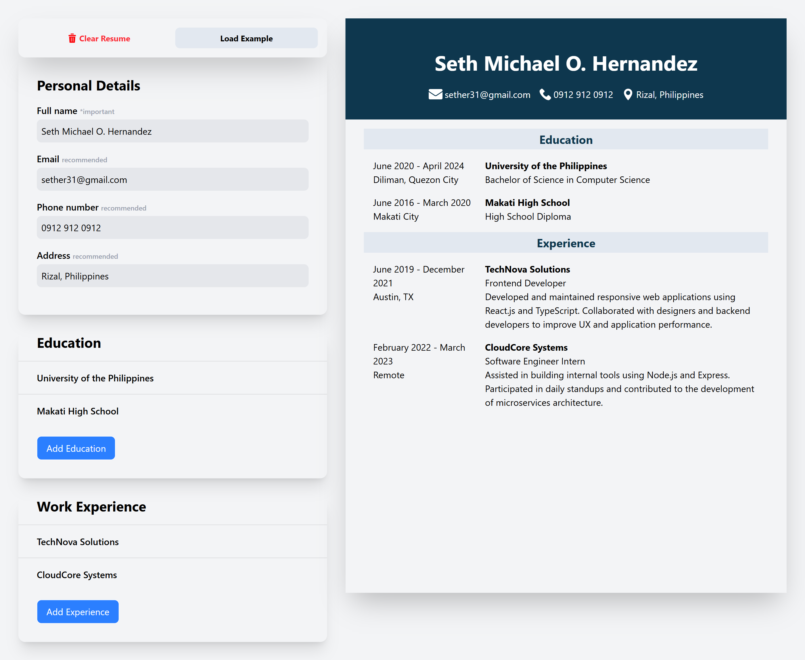

<p align="center">
  
</p>

# CV Builder!

* A lightweight, customizable CV/Resume builder built with modern web technologies. Users can input their personal, educational, and work experience information, and preview a beautifully formatted CV.
* LIVE: <a href="https://cv-builder-sether31.vercel.app/">CV Builder Preview</a>

## How It Works

1. **User Input**
   - The user fills out forms for:
     - Personal information
     - Education history
     - Work experience
   - Each entry is stored in state

2.  **Live Preview**
   - As the user types or edits data, the CV preview updates in real-time
   - Data from the form is passed as props to the CV template component
   - Tailwind CSS ensures a clean, printable layout

## Features
1. **Add/edit/delete: Personal details, Education history, Work experience**
2. **Real-time CV preview**
3. **Responsive design**
## Future Feature
1. **Option to export as PDF**

## Installation

#### 1. **Clone the repository:**
```cmd
git clone https://github.com/sether31/cv-builder.git
```
#### 2. **Install dependencies**
```cmd
npm install
```

## Technologies Used
#### Frontend
  + HTML
  + Tailwind CSS (CSS Framework)
  + React with vite
  + UUID
  + NPM